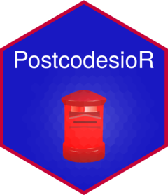

# PostcodesioR 

[](https://travis-ci.org/ropensci/PostcodesioR)
[](https://www.gnu.org/licenses/gpl-3.0.html)
[](https://github.com/ropensci/software-review/issues/176)
[](https://www.repostatus.org/)
[](https://cran.r-project.org/package=PostcodesioR)
[](https://zenodo.org/badge/latestdoi/64221541)


An API wrapper around [postcodes.io](https://postcodes.io/) - free UK postcode lookup and geocoder. This package helps to find and transform information about UK administrative geography like postcodes, LSOA, MSOA, constituencies, counties, wards, districts, CCG or NUTS.

The package is based exclusively on open data provided by postcodes.io. PostcodesioR can be used by data scientists or social scientists working with geocoded UK data. A common task when working with such data is aggregating geocoded data on different administrative levels, e.g. turning postcode-level data into counties or regions. This package can help in achieving this and in many other cases when changing the aggregation of geographic data is required.

## Installation

This package can be installed from GitHub (developmental version) or CRAN (stable).

In order to install PostcodesioR use one of the following commands:

```{r, eval = FALSE}
# stable version
install.packages("PostcodesioR")
```

or

```{r, eval = FALSE}
# developmental version
if(!require("devtools")) {
  install.packages("devtools")
}
devtools::install_github("ropensci/PostcodesioR")
```

## Loading

Load the package by typing

```{r, warning = FALSE, message = FALSE}
library(PostcodesioR)
```

## Examples

Where possible, I tried to return a data frame. Unfortunately, a lot of API calls return more complex data and in those cases it is safer to use lists. The API limits the number of returned calls. Check functions' documentation for more details.

For additional information about the returned data and the function calls see the original [documentation](https://postcodes.io/docs).

The main function of this package provides information related to a given postcode

```{r, message = FALSE, warning = FALSE}
lookup_result <- postcode_lookup("EC1Y8LX")

#overview
str(lookup_result)
```

Check the [vignette](https://docs.ropensci.org/PostcodesioR/articles/Introduction.html) to see all functions in action.

## Citation

Please cite this package if it is used in a publication

`Walczak, E. (2021). PostcodesioR: API Wrapper Around 'Postcodes.io'. R package version 0.3.1, https://cran.r-project.org/web/packages/PostcodesioR/.`

BibTeX entry is here:

```{latex, echo=TRUE, eval=FALSE}
@Manual{,
  title = {PostcodesioR: API Wrapper Around 'Postcodes.io'},
  author = {Eryk Walczak},
  year = {2021},
  doi = {10.5281/zenodo.5717210},
  note = {R package version 0.3.1},
  url = {https://cran.r-project.org/web/packages/PostcodesioR/},
}
```

## Notes

Currently, there is a limit to the number of API calls that can be made. However, [postcodes.io](https://postcodes.io/) provides full list of geolocation data that can be used locally without limitations. The original data is sourced from [Office for National Statistics Data Portal](https://geoportal.statistics.gov.uk/).
That [file](https://github.com/ideal-postcodes/postcodes.io/blob/master/latest) is rather large so I didn't include it in the package.

Go to the package's [website](https://docs.ropensci.org/PostcodesioR/) or to my [blog](https://walczak.org/tag/postcodesior/) for more examples.

## Code of Conduct

Please note that this project is released with a [Contributor Code of Conduct](https://github.com/ropensci/PostcodesioR/blob/master/CONDUCT.md). By participating in this project you agree to abide by its terms.

[](https://ropensci.org)
